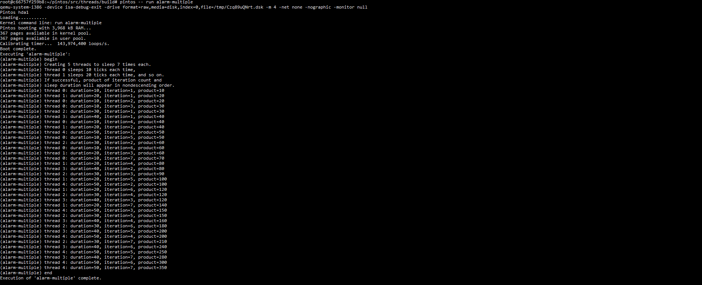

# Project 0: Getting Real

## Preliminaries

>Fill in your name and email address.

Sander Lahoz Christensen <salc@itu.dk>

>If you have any preliminary comments on your submission, notes for the TAs, please give them here.

>Please cite any offline or online sources you consulted while preparing your submission, other than the Pintos documentation, course text, lecture notes, and course staff.

## Booting Pintos

>A1: Put the screenshot of Pintos running example here.

## Debugging

#### QUESTIONS: BIOS 

>B1: What is the first instruction that gets executed?

The first part of Pintos that runs is the loader, in threads/loader.S
The PC BIOS loads the loader from the first sector of the first hard disk, called the master boot record (MBR). Looking at the loader assembly we can see that
first instruction is: sub %ax, %ax

>B2: At which physical address is this instruction located?

Since the master boot record MBR begins at 0x7c00 this also where the first instruction is located.

#### QUESTIONS: BOOTLOADER

>B3: How does the bootloader read disk sectors? In particular, what BIOS interrupt is used?

It uses reader_sector which calls the BIOS interrupt int $0x13 with AH = 0x42 (Extended read). The caller passes the drive number in DL and the sector number in EBX, and the data lands at ES:0000.

>B4: How does the bootloader decides whether it successfully finds the Pintos kernel?

It scans the partition tables of each hard disk (starting at 0x80, then 0x81, ...). For each disk it:

- Reads sector 0 with read_sector. If that fails, the drive doesn't exist, and the scan ends.
- Checks for the MBR signature 0xaa55 at offset 510. If absent, the disk isn't partitioned, so it moves to the next drive.
- Walks the four partition table entries (starting at offset 446, 16 bytes each) and, for each, checks that:
1. the entry is not unused (first 4 bytes non-zero),
2. the partition type (byte 4) is 0x20, the type reserved for Pintos kernels,
3. the partition is bootable (byte 0 is 0x80).

>B5: What happens when the bootloader could not find the Pintos kernel?

If it does not find any drive with the pintos kernel it jumps to the no_such_drive subrutine, which does the following: print "\rNot found\r" and then notifies BIOS using the 0x18 interrupt, common for handling boot failures. 

>B6: At what point and how exactly does the bootloader transfer control to the Pintos kernel?

Once a valid bootable partition is found, the bootloader jumps to load_kernel, which reads the kernel from disk into memory starting at address 0x20000. It reads either the whole partition or 512 kB, whichever is smaller.

When the kernel is fully loaded, the bootloader transfers control to it. The kernel is an ELF file, and the address of its first instruction (the entry point) is stored in the ELF header at offset 0x18. The bootloader reads this address, saves it in a temporary memory location called start, and then does ljmp *start, a jump through that location, so the CPU starts executing the kernel.

#### QUESTIONS: KERNEL

>B7: At the entry of pintos_init(), what is the value of expression `init_page_dir[pd_no(ptov(0))]` in hexadecimal format?

Breakpoint 2, pintos_init () at ../../threads/init.c:78

(gdb) print/x init_page_dir[pd_no(ptov(0))]

=> 0xc000efef:  int3

=> 0xc000efef:  int3

$1 = 0x0

the page tables and directories haven't been populated or mapped yet. Therefore, this specific entry evaluates to a null pointer (0x0).

>B8: When `palloc_get_page()` is called for the first time,

>> B8.1 what does the call stack look like?
>>
>> 

(gdb) break palloc_get_page

Breakpoint 3 at 0xc002311a: file ../../threads/palloc.c, line 113.

(gdb) c

Continuing.

=> 0xc002311a <palloc_get_page+6>:      sub    $0x8,%esp

Breakpoint 3, palloc_get_page (flags=(PAL_ASSERT | PAL_ZERO)) at ../../threads/palloc.c:113

(gdb) bt

==CALLSTACK==

#0  palloc_get_page (flags=(PAL_ASSERT | PAL_ZERO)) at ../../threads/palloc.c:113

#1  0xc00203aa in paging_init () at ../../threads/init.c:168

#2  0xc002031b in pintos_init () at ../../threads/init.c:100

#3  0xc002013d in start () at ../../threads/start.S:180

>> B8.2 what is the return value in hexadecimal format?
>>
>> 

Ran at the entrypoint to palloc_get_page

(gdb) finish

Run till exit from #0  palloc_get_page (flags=(PAL_ASSERT | PAL_ZERO)) at ../../threads/palloc.c:113

=> 0xc00203aa <paging_init+17>: add    $0x10,%esp

0xc00203aa in paging_init () at ../../threads/init.c:168

==RETURN VALUE==

Value returned is $3 = (void *) 0xc0101000

>> B8.3 what is the value of expression `init_page_dir[pd_no(ptov(0))]` in hexadecimal format?
>>
>> 

Ran at the entrypoint to palloc_get_page

(gdb) print/x init_page_dir[pd_no(ptov(0))]

=> 0xc000ef7f:  int3

=> 0xc000ef7f:  int3

==EXPRESSION VALUE==

$2 = 0x0

>B9: When palloc_get_page() is called for the third time,

>> B9.1 what does the call stack look like?
>>
>> 

Breakpoint 3, palloc_get_page (flags=(PAL_ASSERT | PAL_ZERO)) at ../../threads/palloc.c:113

(gdb) continue

Continuing.

=> 0xc002311a <palloc_get_page+6>:      sub    $0x8,%esp

Breakpoint 3, palloc_get_page (flags=PAL_ZERO) at ../../threads/palloc.c:113

(gdb) bt

#0  palloc_get_page (flags=PAL_ZERO) at ../../threads/palloc.c:113

#1  0xc0020a81 in thread_create (name=0xc002e895 "idle", priority=0, 
function=0xc0020eb0 <idle>, aux=0xc000efbc) at ../../threads/thread.c:178

==CALLSTACK==

#2  0xc0020976 in thread_start () at ../../threads/thread.c:111

#3  0xc0020334 in pintos_init () at ../../threads/init.c:119

#4  0xc002013d in start () at ../../threads/start.S:180

>> B9.2 what is the return value in hexadecimal format?
>>
>> 

Ran at the entrypoint to palloc_get_page

(gdb) finish

Run till exit from #0  palloc_get_page (flags=PAL_ZERO) at ../../threads/palloc.c:113

=> 0xc0020a81 <thread_create+55>:       add    $0x10,%esp

0xc0020a81 in thread_create (name=0xc002e895 "idle", priority=0, function=0xc0020eb0 <idle>, aux=0xc000efbc) at ../../threads/thread.c:178

==RETURN VALUE==

Value returned is $5 = (void *) 0xc0103000

>> B9.3 what is the value of expression `init_page_dir[pd_no(ptov(0))]` in hexadecimal format?
>>
>> 

Ran at the entrypoint to palloc_get_page

(gdb) print/x init_page_dir[pd_no(ptov(0))]

=> 0xc000ef3f:  int3

=> 0xc000ef3f:  int3

==EXPRESSION VALUE==

$4 = 0x102027

## Kernel Monitor

>C1: Put the screenshot of your kernel monitor running example here. (It should show how your kernel shell respond to `whoami`, `exit`, and `other input`.)

#### 

>C2: Explain how you read and write to the console for the kernel monitor.
